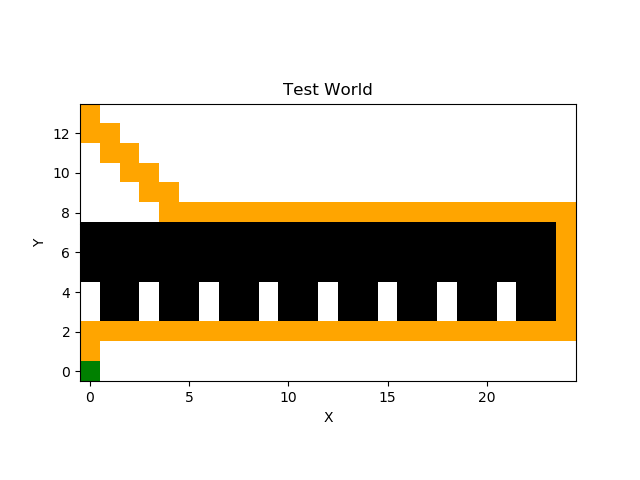

# PoE Labyrinth Simulator & AI

## Background
Path of Exile (PoE) is a popular action role-playing video game developed by Grinding Gear Games
(now acquired by Tencent). 
A core part of the game, known as the Labyrinth, requires players to navigate their characters
through **randomly generated puzzles** filled with lethal traps.

Finding ways to automate video games has always been a hobby I enjoyed; and as far as game mechanics went,
this one was particularly unique. What really stood out to me however, was the fact it couldn't easily be solved by 
typical automation techniques that were based on routines, memorization, or heuristics.

## Simulation and AI
So I got thinking, and thought why don't I try an "intelligent" approach for this problem? Before committing
to a solution, I decided to make a proof-of-concept in a simulated version of the Labyrinth
first.

The approach is straight-forward:
* Represent the game-state and it's entities as a list of objects and NumPy arrays.
* Model basic game mechanics such as movement, path obstruction, and periodic traps.
* At each simulation time-step, define a metric which represents how "good" a position is (i.e. 
is my character damaged by a trap and am I close to the end of Labyrinth).

With a rough simulation of the game in-place, the AI is implemented using a decision tree with pruning.
In short:
* At each step, perform a simulation of each possible action the character can take.
* Evaluate, how "good" this action is based on the aforementioned metric.
* Prune the least promising branches, and then recurse until the desired depth.

The computation time quickly grows out of control as the search depth increases (as expected). 
With that being said, a completely unoptimized, single-threaded implementation in Python, can still search 4-5 levels
deep (in real-time) which is more than adequate for solving the puzzles found in the Labyrinth.

## Demo
To run the demo, simply run the `test_world.py` script located in the demo folder after installing the pre-requisites
as follows:
~~~~
pip install numpy
pip install matplotlib

cd ./Demo
python test_world.py
~~~~

## Test World
The simulator is pretty flexible, and allows the user to implement more or less whatever they want.
I decided to test my implementation in a world with two main gauntlets: (1) the first requires hiding in side
cubby and waiting out periodic floor traps, (2) the second requires either waiting or zig-zaging across the alternating
tiled floor traps.

For those who've played PoE, this should be highly reminiscent of the first Labyrinth encounter in the game, as 
some of the same "strategies" are tested. As shown below, with a relatively shallow search depth of 3, the agent
has no problem navigating this example.

## Example Gameplay
For those not familiar with the game, the following is a sample of a puzzle that a player may face in the Labyrinth.

